# link-generator 시스템 개요

> 이 문서는 이전 fragment 기반 구현의 기록입니다. 현재 구현은 [구절·페이지 기반 문서 연결](document-link-workflow.md)을 참고하세요.

## 1. 문서 정보

- 프로젝트명: **6호선 길라잡이 Da-Al-G**
- 대상: `backend/` 문서·Graph RAG API와 `link-generator/` 링크 생성기
- 문서 목적: 프로그램의 주제, 목표, 구성 요소, 데이터 흐름, 현재 사용 방법과 한계를 한 곳에서 설명
- 기준 구현: 2026-08-25 현재 테스트 버전
- 현재 상태: 문서 간 수동 연결과 Graph RAG 연동을 검증하는 초기 프로토타입

## 2. 주제와 문제 정의

이 프로그램의 주제는 **서로 다른 철도 운영·업무 문서의 특정 근거 영역을 연결하고, 연결 관계를 검색·질의응답에 활용하는 문서 지식 그래프 구축**이다.

현업 문서는 HWP/HWPX, PPTX, PDF처럼 형식이 서로 다르고, 같은 업무 내용을 여러 문서가 서로 다른 방식으로 설명한다. 단순히 문서 전체를 검색하면 다음 정보가 손실된다.

- 어떤 문서의 어느 문단·페이지·슬라이드가 근거인지
- 한 문서의 절차와 다른 문서의 예외·시각 자료가 어떻게 연결되는지
- 관리자가 실제로 확인하고 승인한 관계인지

따라서 원본 파일은 보존하고, 문서 내부의 텍스트·표·이미지·페이지·슬라이드를 검색 가능한 작은 단위인 **fragment**로 정규화한다. 관리자는 화면에서 실제 문서를 읽고 필요한 영역만 드래그하거나 페이지 단위로 선택해 명시적인 연결을 만든다.

## 3. 목표와 비목표

### 목표

1. 원본 문서와 원본 위치 정보를 보존하면서 여러 포맷을 하나의 검색 모델로 다룬다.
2. 관리자가 파일 탐색기처럼 문서를 찾고, 양쪽 문서의 관련 영역을 쉽게 선택하게 한다.
3. HWP/HWPX는 텍스트를 정확하게 긁을 수 있게 하고, PPTX처럼 시각 요소가 많은 문서는 슬라이드 전체를 안정적으로 연결하게 한다.
4. 선택 결과를 fragment 간 edge 초안으로 저장하고, 관리자 승인 이후에만 Graph RAG에 반영한다.
5. 벡터 검색과 승인된 그래프 연결을 함께 사용해 관련 규정·절차·예외·시각 자료를 근거로 제시한다.

### 비목표

- 원본 HWP/PPTX를 브라우저에서 편집하는 워드프로세서나 프레젠테이션 편집기를 만드는 것
- 변환된 PDF가 모든 Office 글꼴·효과·애니메이션을 100% 동일하게 재현하는 것
- AI가 관리자 검토 없이 문서 관계를 확정하는 것
- 현재 프로토타입에서 기관용 인증·권한·감사 정책을 완성하는 것

## 4. 전체 구조

```mermaid
flowchart LR
    A[LOCAL_DOCUMENT_ROOTS\n로컬 문서 폴더] --> B[link-generator\nReact/Vite 파일 탐색기]
    B -->|POST /api/local/open| C[FastAPI 백엔드]
    C --> D[Parser Registry]
    D --> E[Document / Version / Fragment]
    E --> F[Embedding Provider]
    E --> G[문서 Viewer]
    G -->|텍스트 드래그·이미지 클릭·슬라이드 선택| H[Selection Anchor]
    H -->|POST /api/edges/batch| I[Knowledge Edge 초안]
    I --> J[관리자 승인 큐]
    J --> K[승인된 지식 그래프]
    F --> L[Vector 검색]
    K --> M[Graph RAG]
    L --> M
    M --> N[근거가 포함된 답변]
```



핵심 원칙은 **사용자는 보이는 텍스트나 페이지를 선택하고, fragment·chunk 처리는 백그라운드에서 수행한다**는 것이다. fragment는 링크를 저장하고 검색하기 위한 내부 단위이며, 사용자가 fragment 경계를 직접 맞출 필요가 없다.

## 5. 코드 구조

### 백엔드

| 경로 | 역할 |
| --- | --- |
| `backend/app/main.py` | FastAPI 앱, 시작 시 DB 초기화, 문서·fragment·edge·RAG API 제공 |
| `backend/app/config.py` | DB, 저장소, 로컬 문서 루트, PDF 변환기, embedding 관련 설정 |
| `backend/app/db.py` | SQLAlchemy engine/session, SQLite 호환 컬럼 보정, PostgreSQL vector extension 초기화 |
| `backend/app/models.py` | `Document`, `DocumentVersion`, `Fragment`, `KnowledgeEdge`, ingestion/audit 모델 |
| `backend/app/schemas.py` | API 입출력 모델과 선택 anchor·edge·RAG 질의 검증 |
| `backend/app/services/local_files.py` | 설정된 루트 안의 지원 파일 탐색 및 경로 탈출 방지 |
| `backend/app/services/ingestion.py` | 파싱, chunk 확장, asset 저장, embedding 생성, DB 적재 |
| `backend/app/services/pdf_conversion.py` | PPTX를 LibreOffice로 PDF 변환, 캐시와 페이지 수 검증 |
| `backend/app/services/embedding.py` | OpenAI embedding 또는 오프라인 결정론적 hash embedding |
| `backend/app/services/rag.py` | 벡터 seed 검색, 승인 edge 확장, 답변 생성 |
| `backend/app/parsers/registry.py` | 확장자에 따른 parser 선택 |
| `backend/app/parsers/hwp_parser.py` | rhwp-python 기반 HWP 구조 파싱 및 hwp5txt fallback |
| `backend/app/parsers/hwpx_parser.py` | python-hwpx 기반 HWPX 텍스트·문단·표 파싱 |
| `backend/app/parsers/pptx_parser.py` | python-pptx 기반 슬라이드·도형·표·이미지 파싱 |
| `backend/app/parsers/pdf_parser.py` | pypdf 기반 PDF 페이지별 텍스트 fragment 생성 |

### 프론트엔드

| 경로 | 역할 |
| --- | --- |
| `link-generator/src/main.jsx` | 파일 탐색기, 좌·우 문서 열기, 선택 상태, 링크 생성·승인·RAG 질의 화면 |
| `link-generator/src/document-viewer.jsx` | HWP/HWPX, PPTX→PDF, PDF 렌더러와 선택 anchor 변환 |
| `link-generator/src/styles.css` | 탐색기·viewer·선택 상태·페이지/슬라이드 버튼의 화면 스타일 |
| `link-generator/package.json` | React/Vite와 rhwp, PDF.js, PPTX 렌더링 의존성 |

## 6. 핵심 데이터 모델

### Document와 DocumentVersion

`Document`는 논리적인 문서 식별자이다. 파일명, MIME type, 원본 경로, SHA-256, 처리 상태를 가진다. 같은 문서가 수정되면 `DocumentVersion`을 추가해 parser 이름·버전, 저장 경로, 처리 상태, 오류와 메타데이터를 보존한다.

### Fragment

Fragment는 검색·연결의 최소 단위이다.

| 필드 | 의미 |
| --- | --- |
| `id` | 내부 불변 식별자 |
| `version_id` | 어느 문서 버전에 속하는지 |
| `parent_id` | 문서·슬라이드·페이지와 하위 영역의 계층 관계 |
| `stable_key` | parser가 부여한 원본 내부 키 |
| `kind` | `paragraph`, `table`, `image`, `slide`, `page` 등 |
| `ordinal` | 원본 읽기 순서 |
| `text`, `html`, `table_json` | 검색·viewer 표시용 내용 |
| `locator_json` | `page`, `slide`, `paragraph`, `shape_id` 등 원본 위치 |
| `bbox_json` | PPTX 도형의 원본 좌표 등 시각 영역 |
| `asset_path` | 추출된 이미지 파일 경로 |
| `embedding_*` | 벡터 검색용 embedding |
| `metadata_json` | parser 상태, chunk 위치, degraded 여부 등 부가 정보 |

긴 fragment는 ingestion 단계에서 최대 약 1,800자와 겹침 약 220자를 기준으로 내부 chunk로 확장된다. 이 처리는 embedding과 검색을 위한 백그라운드 작업이다. HWP 추출 화면에서는 같은 논리 영역의 중복 chunk를 한 번만 보여주며, 사용자는 chunk를 선택하지 않는다.

### SelectionAnchor

사용자가 화면에서 선택한 결과를 다음 정보로 표현한다.

```json
{
  "fragment_id": "fragment-uuid",
  "start_offset": 0,
  "end_offset": 48,
  "selected_text": "사용자가 실제로 드래그한 텍스트",
  "locator_json": {"paragraph": 12}
}
```

텍스트 선택은 fragment 내부 offset을 저장한다. 이미지·슬라이드·페이지 전체 선택은 offset을 0 또는 전체 길이로 두고 `locator_json`으로 원본 위치를 함께 보존한다.

### KnowledgeEdge

KnowledgeEdge는 두 fragment 사이의 관계이다.

- `source_fragment_id`, `target_fragment_id`: 연결되는 두 영역
- `relation_type`: `REFERENCES`, `PROCEDURE`, `EXCEPTION`, `VISUAL_HELP`, `SUPERSEDES`, `RELATED`
- `status`: 기본 `draft`, 이후 `approved` 또는 `rejected`
- `source_anchor`, `target_anchor`: 화면에서 선택한 세부 영역
- `note`, `created_by`, `approved_by`, `created_at`, `approved_at`: 설명·감사 정보

링크 생성기에서 여러 영역을 선택하면 `/api/edges/batch`가 source와 target의 모든 조합을 만들어 다대다 초안으로 저장한다. 초안과 반려된 edge는 Graph RAG에서 제외된다.

## 7. 문서가 열리고 링크가 저장되는 과정

### 7.1 파일 탐색과 안전한 열기

1. 백엔드는 `.env`의 `LOCAL_DOCUMENT_ROOTS`를 문서 루트로 읽는다.
2. `GET /api/local/roots`가 루트 목록을 반환한다.
3. `GET /api/local/files`가 루트 아래의 `.hwp`, `.hwpx`, `.pptx`, `.pdf`를 재귀적으로 찾는다.
4. 프론트엔드 파일 탐색기는 폴더·상위 폴더·검색 결과를 표시한다.
5. 사용자가 왼쪽 또는 오른쪽을 누르면 `POST /api/local/open`이 호출된다.
6. 백엔드는 상대 경로가 설정된 루트 밖으로 벗어나지 않는지 검사한 뒤 문서를 인덱싱한다.

### 7.2 Ingestion과 fragment 생성

`IngestionService`는 문서를 동기적으로 처리한다.

1. 파일 SHA-256으로 기존 문서 여부를 확인한다.
2. `Document`, `DocumentVersion`, `IngestionJob`를 만든다.
3. 확장자에 맞는 parser를 `Parser Registry`에서 선택한다.
4. 텍스트·표·이미지·페이지·슬라이드와 위치 정보를 `ParsedFragment`로 만든다.
5. 긴 텍스트를 내부 chunk로 확장한다.
6. fragment 내용으로 embedding을 생성한다.
7. 이미지는 `runtime/storage/assets/<version_id>/`에 저장한다.
8. DB에 fragment와 embedding을 저장하고 문서 상태를 `ready`로 바꾼다.

현재는 문서를 처음 열 때 이 처리가 요청 안에서 수행된다. 큰 문서는 처리 중 시간이 걸릴 수 있으므로 운영 단계에서는 비동기 worker와 진행 상태 UI가 필요하다.

### 7.3 포맷별 파싱과 렌더링

| 형식 | 백엔드 인덱싱 | 화면 표시 및 링크 방식 |
| --- | --- | --- |
| HWP | rhwp-python 우선, 실패 시 hwp5txt fallback | 기본은 추출 텍스트, 선택적으로 읽기 전용 editor 또는 rhwp 원본 레이아웃 |
| HWPX | python-hwpx로 문서·문단·표 추출 | HWP와 같은 추출 텍스트/읽기 전용 editor/rhwp 레이아웃 선택 방식 |
| PPTX | python-pptx로 슬라이드·도형·표·이미지와 `slide` locator 생성 | 항상 백엔드에서 PDF로 변환한 뒤 PDF.js로 표시하고, 페이지 버튼으로 슬라이드 전체 선택 |
| PDF | pypdf로 페이지별 텍스트 fragment 생성 | PDF.js canvas와 text layer, 페이지 이동 및 텍스트 드래그 |

#### HWP/HWPX의 세 가지 선택 방식

- **추출 텍스트 (권장)**: 화면 좌표와 원본 SVG가 어긋나는 문제를 피하고, parser가 추출한 텍스트 카드를 바로 드래그한다. 같은 논리 영역의 중복 chunk는 화면에서 숨긴다.
- **텍스트 편집기 (읽기 전용)**: 추출 텍스트를 하나의 `textarea`에 넣는다. 편집은 저장되지 않으며, `selectionStart`/`selectionEnd`를 fragment offset으로 변환한다. 긴 문서에서 검색·복사·드래그하기 쉽다.
- **원본 레이아웃 (rhwp)**: 원본 모양을 확인할 때 사용한다. rhwp SVG와 텍스트 hit layer를 겹쳐 놓고 선택하며, 시각적 검토가 필요한 경우의 보조 방식이다.

즉 HWP에서 사용자가 보는 것은 텍스트이고, fragment chunk 분할과 anchor 매핑은 백그라운드에서 수행된다. 선택 중에는 React 화면을 다시 그리지 않아 커서가 빈 공간으로 이동할 때 선택 영역이 튀는 현상을 줄인다.

#### PPTX의 PDF 및 슬라이드 선택

PPTX는 이미지와 복잡한 도형이 많기 때문에 브라우저에서 PPTX를 직접 대량 렌더링하는 방식보다 PDF 페이지를 보여주는 방식이 현재 기본이다.

1. `GET /api/documents/{document_id}/pdf`가 요청된다.
2. 백엔드 `PdfConversionService`가 LibreOffice Impress headless renderer를 사용한다.
3. 변환 결과는 `runtime/storage/converted-pdf/`에 캐시한다.
4. 원본 슬라이드 수와 PDF 페이지 수가 같은지 검증한다.
5. 프론트엔드 PDF.js가 한 번에 현재 페이지를 canvas와 text layer로 렌더링한다.
6. `‹ 이전`, `다음 ›`으로 페이지를 이동한다.
7. **이 슬라이드 링크 선택**을 누르면 현재 PDF 페이지 번호를 원본 `slide` fragment에 매핑해 슬라이드 전체 anchor를 만든다.

따라서 PPTX의 기본 사용법은 텍스트를 세밀하게 긁는 것이 아니라, 연결할 슬라이드로 이동한 뒤 페이지 선택 버튼을 누르는 것이다. PPTX PDF 변환은 LibreOffice와 설치된 글꼴에 영향을 받으며, 실제 변환기가 없을 때의 ReportLab 근사 fallback은 기본 비활성화되어 있다.

### 7.4 선택을 anchor로 바꾸는 원리

프론트엔드는 브라우저의 native selection 또는 editor의 selection range를 읽는다.

1. 선택된 텍스트를 NFKC 정규화하고 공백을 정리한다.
2. 원본 fragment 텍스트에서 같은 문자열의 시작·끝 offset을 찾는다.
3. fragment ID, offset, 선택 미리보기, 원본 locator를 `SelectionAnchor`로 만든다.
4. HWP 추출 카드가 여러 개 걸치면 해당 fragment마다 anchor를 만든다.
5. PDF에서 텍스트가 없거나 선택이 사라져도 현재 페이지를 감지해 페이지 anchor를 만들 수 있다.
6. 이미지 클릭은 해당 이미지 fragment를 offset 0의 anchor로 만든다.

### 7.5 edge 생성과 승인

1. 왼쪽 문서에서 source 영역을 선택한다.
2. 오른쪽 문서에서 target 영역을 선택한다.
3. 메모를 입력하고 링크를 저장한다.
4. `POST /api/edges/batch`가 선택된 모든 source-target 조합을 `draft`로 저장한다.
5. 승인 큐에서 관리자가 내용을 확인하고 승인 또는 반려한다.
6. 승인된 edge만 이웃 탐색과 RAG 확장에 사용된다.

## 8. Graph RAG 작동 원리

`POST /api/rag/query`가 질문을 받으면 다음 순서로 처리한다.

1. 질문을 현재 embedding provider로 벡터화한다.
2. PostgreSQL + pgvector 환경에서는 vector/HNSW 검색을 우선 사용한다.
3. SQLite 개발 환경에서는 저장된 JSON embedding과 cosine similarity 기반 fallback을 사용한다.
4. 상위 fragment를 vector seed로 선택한다.
5. 승인된 KnowledgeEdge만 adjacency graph로 구성한다.
6. `max_hops` 범위에서 이웃 fragment를 확장한다.
7. 관계 유형별 가중치와 hop 거리를 반영해 evidence를 정렬한다.
8. OpenAI API key가 있으면 LLM이 문서 근거만 사용해 답변하고, 없으면 검색 fragment 요약을 반환한다.

그래프 연결의 목적은 단순히 비슷한 문장을 찾는 데 그치지 않고, 예를 들어 **규정 원문 → 작업 절차 → 예외 조건 → 시각 자료**와 같이 사람이 확인한 관계를 따라 근거를 확장하는 것이다.

## 9. 주요 API

| API | 용도 |
| --- | --- |
| `GET /health` | 백엔드 상태와 embedding provider 확인 |
| `GET /api/local/roots` | 설정된 로컬 문서 루트 조회 |
| `GET /api/local/files` | 지원 문서 탐색·검색 |
| `POST /api/local/open` | 로컬 파일 안전 확인, ingestion, 문서/version 반환 |
| `POST /api/documents/upload` | 업로드 파일 ingestion |
| `GET /api/documents/{id}/source` | HWP/HWPX/PDF 등 원본 바이트 제공 |
| `GET /api/documents/{id}/pdf` | PPTX PDF 변환 결과 제공 |
| `GET /api/documents/{id}/fragments` | viewer와 검색에 필요한 fragment 조회 |
| `GET /api/fragments/{id}/asset` | 추출된 이미지 asset 제공 |
| `POST /api/edges` | 단일 edge 초안 생성 |
| `POST /api/edges/batch` | 여러 anchor 조합의 다대다 edge 초안 생성 |
| `GET /api/edges?status=draft` | 승인 대기 edge 조회 |
| `POST /api/edges/{id}/approve` | edge 승인 |
| `POST /api/edges/{id}/reject` | edge 반려 |
| `GET /api/fragments/{id}/neighbors` | 승인된 이웃 fragment 조회 |
| `POST /api/rag/query` | vector 검색과 graph expansion을 이용한 질의 |

## 10. 실행 환경과 주요 설정

백엔드 기본 DB는 `sqlite:///./runtime/daalgi.db`이며, 운영에서는 PostgreSQL + pgvector를 사용할 수 있다. 주요 설정은 `backend/.env`에서 관리한다.

| 설정 | 의미 |
| --- | --- |
| `LOCAL_DOCUMENT_ROOTS` | 탐색할 로컬 문서 폴더. 여러 루트는 OS path separator로 구분 |
| `DATABASE_URL` | SQLite 또는 PostgreSQL 연결 문자열 |
| `STORAGE_ROOT` | 변환 PDF와 추출 asset 저장 위치 |
| `PPTX_PDF_CONVERTER` | LibreOffice/soffice 실행 파일 경로 |
| `ALLOW_APPROXIMATE_PDF_FALLBACK` | 테스트용 ReportLab 근사 변환 허용 여부 |
| `EMBEDDING_PROVIDER` | `auto`, `openai` 또는 로컬 hash provider 선택 |
| `OPENAI_API_KEY` | OpenAI embedding/답변 생성에 사용하는 키 |
| `EMBEDDING_MODEL` | 기본 `text-embedding-3-small` |
| `DEFAULT_GRAPH_HOPS` | 기본 Graph RAG 확장 hop 수 |
| `MAX_UPLOAD_BYTES` | 업로드 파일 최대 크기 |

개발 실행:

```bash
# 백엔드
cd backend
uv sync --extra hwp --extra dev
uv run uvicorn app.main:app --reload --port 8000

# 프론트엔드
cd link-generator
npm install
npm run dev
```

## 11. 일반 사용 흐름

1. 백엔드와 프론트엔드를 실행한다.
2. 파일 탐색기에서 문서 루트를 선택하고 문서를 왼쪽 또는 오른쪽에 연다.
3. HWP/HWPX는 기본 `추출 텍스트` 방식에서 필요한 문장을 드래그한다. 긴 문서에서는 `텍스트 편집기` 방식도 사용할 수 있다.
4. PPTX는 PDF 페이지를 넘긴 뒤 `이 슬라이드 링크 선택`을 누른다.
5. PDF는 필요한 페이지의 텍스트를 드래그하거나, 페이지 단위 fallback을 사용한다.
6. 반대편 문서에서도 같은 방식으로 영역을 선택한다.
7. 필요하면 메모를 남기고 링크 초안을 저장한다.
8. 승인 대기 목록에서 edge를 검토하고 승인한다.
9. RAG 질의 화면에서 질문하고, 답변과 fragment 근거 및 hop 정보를 확인한다.

## 12. 현재 설계의 장점과 한계

### 장점

- 원본 파일을 수정하지 않고 내부 ID와 locator로 provenance를 유지한다.
- 파일 형식이 달라도 fragment와 anchor라는 공통 모델로 연결할 수 있다.
- HWP는 읽기 편한 텍스트 선택과 원본 레이아웃 확인을 함께 제공한다.
- PPTX는 무거운 직접 렌더링 대신 PDF.js의 현재 페이지 렌더링을 사용해 멈춤 위험을 줄인다.
- 관리자 승인 단계를 두어 자동 검색 결과와 확정된 지식 관계를 구분한다.
- OpenAI key가 없는 오프라인 개발 환경에서도 hash embedding으로 전체 흐름을 시험할 수 있다.

### 한계와 향후 보완

- HWP 구조 parser를 사용할 수 없으면 hwp5txt fallback으로 낮아지고, 표·이미지·정밀 위치 정보가 제한된다.
- PPTX PDF 품질은 LibreOffice 버전, 설치 글꼴, 원본 Office 효과에 영향을 받는다.
- 스캔 PDF는 현재 OCR이 없으면 텍스트 fragment가 생성되지 않는다.
- ingestion이 동기식이어서 대형 파일은 첫 열기 시간이 길 수 있다.
- 개발용 인증은 `X-Admin-Actor` 헤더 수준이며, 운영에는 SSO/세션과 관리자 RBAC가 필요하다.
- 업로드·로컬 파일에 대한 악성코드 검사, 감사 정책 강화, 백그라운드 worker가 필요하다.
- 문서 버전이 바뀌었을 때 기존 edge를 재검증하거나 재매핑하는 정책이 아직 필요하다.

## 13. 검증 명령

```bash
cd backend
uv run --extra hwp --extra dev pytest
uv run --extra dev ruff check app tests

cd ../link-generator
npm run build
```

핵심 수동 검증 항목은 다음과 같다.

- HWP 기본 추출 텍스트에서 드래그한 내용이 연결 영역에 표시되는가
- 빈 공간으로 커서를 옮겨도 선택 anchor와 하이라이트가 유지되는가
- 읽기 전용 editor에서 선택 범위가 fragment offset으로 변환되는가
- PPTX가 PDF로 열리고 페이지 수가 원본 슬라이드 수와 일치하는가
- `이 슬라이드 링크 선택`이 현재 페이지를 해당 slide fragment로 연결하는가
- edge 승인 전 RAG에서 제외되고 승인 후 graph hop 근거로 나타나는가

## 14. 용어 정리

| 용어 | 뜻 |
| --- | --- |
| Document | 논리적인 원본 문서 |
| DocumentVersion | 특정 시점의 문서 파일과 parser 처리 결과 |
| Fragment | 검색·연결 가능한 문서 내부 영역 |
| Chunk | 긴 fragment를 embedding하기 위해 백그라운드에서 나눈 조각 |
| Locator | 페이지·슬라이드·문단·도형 등 원본 위치 정보 |
| BBox | 도형·이미지의 좌표와 크기 정보 |
| Anchor | 사용자의 실제 선택을 fragment와 offset으로 표현한 객체 |
| Edge | 두 fragment 사이의 의미 관계 |
| Draft | 관리자가 아직 승인하지 않은 edge |
| Graph RAG | 벡터 검색 결과에서 승인된 edge를 따라 근거를 확장하는 검색 방식 |
